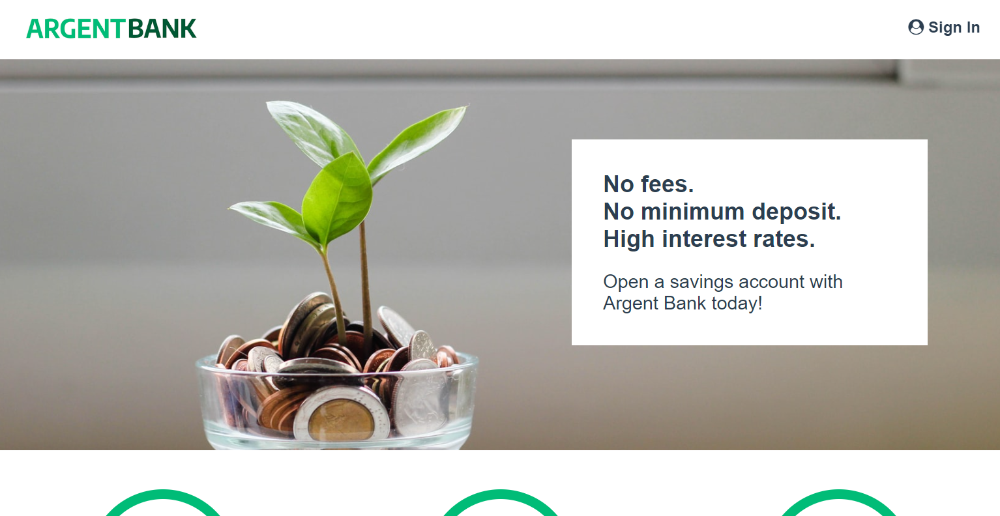

# ArgentBank


Projet 12 du parcours "**Développeur d'application - JavaScript React**" chez [OpenClassroom](https://openclassrooms.com/fr/).

## Description

Utilisez une API pour un compte utilisateur bancaire avec React



Vous venez de commencer à travailler chez Remede Agency, une agence spécialisée dans le développement d'applications web.

## Installation

Ce projet a été testé et réalisé avec la version 20.15.1 de Node.js

Note: Il est possible que le back ne fonctionne que sur la version v12 de node, pensez à utiliser nvm.

### Partie Back

```bash
# To back
cd back

# Install dependencies
npm install

# Start local dev server
npm run dev:server

# Populate database with two users
npm run populate-db
```

### Partie Front

```bash
# To front
cd front

# Install dependencies
npm install

# Start local dev
npm run dev
```

## Données

Une fois que vous avez lancez le script `populate-db`, vous devriez avoir deux utilisateurs dans votre base de donnée:

### Tony Stark

- First Name: `Tony`
- Last Name: `Stark`
- Email: `tony@stark.com`
- Password: `password123`

### Steve Rogers

- First Name: `Steve`,
- Last Name: `Rogers`,
- Email: `steve@rogers.com`,
- Password: `password456`

[](<[http://](https://github.com/code9g/)>)
[](https://www.linkedin.com/in/pierre-andre-henry/)
